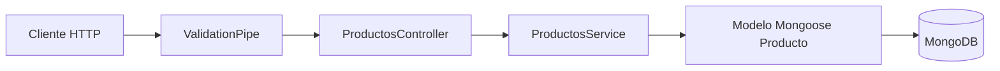

# Backend de Productos

API REST para la gestión de productos, desarrollada con NestJS, TypeScript,
MongoDB y Mongoose. El proyecto permite crear, consultar, actualizar y eliminar
productos, y aplica validación global a los datos recibidos.

## Tecnologías utilizadas

- Node.js
- NestJS 11
- TypeScript
- MongoDB
- Mongoose
- `class-validator` y `class-transformer`
- Jest y Supertest
- ESLint y Prettier

## Arquitectura

El proyecto utiliza la arquitectura modular propuesta por NestJS y separa las
responsabilidades de transporte HTTP, validación, lógica de negocio y acceso a
datos.



### Componentes principales

- **`main.ts`**: inicia la aplicación, habilita la validación global y configura
  el puerto del servidor.
- **`AppModule`**: módulo raíz. Carga las variables de entorno, establece la
  conexión con MongoDB e importa el módulo de productos.
- **`ProductosModule`**: encapsula el controlador, servicio y esquema del dominio
  de productos.
- **`ProductosController`**: expone los endpoints REST y delega las operaciones al
  servicio.
- **`ProductosService`**: implementa la lógica del CRUD y utiliza el modelo de
  Mongoose.
- **`CreateProductoDto`**: valida los datos necesarios para crear un producto.
- **`UpdateProductoDto`**: permite actualizar parcialmente un producto.
- **`ProductoSchema`**: define la estructura, restricciones e índices del
  documento almacenado en MongoDB.

### Flujo de una solicitud

Una solicitud para crear un producto sigue este recorrido:

1. El cliente envía `POST /productos`.
2. `ValidationPipe` transforma la entrada y rechaza propiedades no declaradas.
3. `CreateProductoDto` valida el nombre, la descripción y el precio.
4. `ProductosController` entrega la operación a `ProductosService`.
5. El servicio obtiene el siguiente identificador y crea el documento.
6. Mongoose persiste el producto en MongoDB.
7. NestJS devuelve el producto creado al cliente.

## Estructura del proyecto

```text
backend-productos/
├── src/
│   ├── productos/
│   │   ├── dto/
│   │   │   ├── create-producto.dto.ts
│   │   │   └── update-producto.dto.ts
│   │   ├── entities/
│   │   │   └── producto.entity.ts
│   │   ├── schemas/
│   │   │   └── producto.schema.ts
│   │   ├── productos.controller.ts
│   │   ├── productos.controller.spec.ts
│   │   ├── productos.module.ts
│   │   ├── productos.service.ts
│   │   └── productos.service.spec.ts
│   ├── app.controller.ts
│   ├── app.controller.spec.ts
│   ├── app.module.ts
│   ├── app.service.ts
│   └── main.ts
├── test/
│   ├── app.e2e-spec.ts
│   └── jest-e2e.json
├── .env
├── nest-cli.json
├── package.json
├── tsconfig.build.json
└── tsconfig.json
```

## Requisitos previos

- Node.js compatible con NestJS 11.
- npm.
- Una instancia local o remota de MongoDB.
- Opcionalmente, Nest CLI para generar nuevos recursos.

Compruebe las versiones instaladas con:

```bash
node --version
npm --version
```

## Variables de entorno

Cree un archivo `.env` en la raíz del proyecto:

```env
MONGODB_URI=mongodb://localhost:27017/productos
PORT=3000
```

| Variable | Obligatoria | Descripción |
|---|---:|---|
| `MONGODB_URI` | Sí | URI de conexión a MongoDB. |
| `PORT` | No | Puerto HTTP. Si se omite, se utiliza `3000`. |

El archivo `.env` está excluido del control de versiones. No publique
credenciales reales. Para MongoDB Atlas, utilice la cadena de conexión entregada
por la plataforma y reemplace usuario, contraseña y nombre de la base de datos.

## Instalación y ejecución

Instale las dependencias:

```bash
npm install
```

Inicie la aplicación en modo desarrollo:

```bash
npm run start:dev
```

La API estará disponible por defecto en:

```text
http://localhost:3000
```

Otros modos de ejecución:

```bash
# Ejecución normal
npm run start

# Desarrollo con depurador y recarga automática
npm run start:debug

# Compilar para producción
npm run build

# Ejecutar la compilación de producción
npm run start:prod
```

## Endpoints

| Método | Ruta | Descripción | Respuesta esperada |
|---|---|---|---:|
| `GET` | `/` | Comprueba que la aplicación responde. | `200` |
| `POST` | `/productos` | Crea un producto. | `201` |
| `GET` | `/productos` | Lista los productos ordenados por ID. | `200` |
| `GET` | `/productos/:id` | Consulta un producto por su ID numérico. | `200` |
| `PATCH` | `/productos/:id` | Actualiza parcialmente un producto. | `200` |
| `DELETE` | `/productos/:id` | Elimina un producto. | `200` |

### Modelo de producto

| Campo | Tipo | Requerido | Restricciones |
|---|---|---:|---|
| `id` | número | Sí | Único y generado por el servicio. |
| `nombre` | texto | Sí | No puede estar vacío. |
| `descripcion` | texto | Sí | No puede estar vacía. |
| `precio` | número | Sí | Debe ser mayor o igual que cero. |
| `createdAt` | fecha | Automático | Generado por Mongoose. |
| `updatedAt` | fecha | Automático | Generado por Mongoose. |

### Crear un producto

```bash
curl -X POST http://localhost:3000/productos \
  -H "Content-Type: application/json" \
  -d '{
    "nombre": "Teclado mecánico",
    "descripcion": "Teclado con interruptores azules",
    "precio": 180000
  }'
```

Ejemplo de respuesta:

```json
{
  "id": 1,
  "nombre": "Teclado mecánico",
  "descripcion": "Teclado con interruptores azules",
  "precio": 180000,
  "createdAt": "2026-01-01T12:00:00.000Z",
  "updatedAt": "2026-01-01T12:00:00.000Z"
}
```

### Listar productos

```bash
curl http://localhost:3000/productos
```

### Consultar un producto

```bash
curl http://localhost:3000/productos/1
```

### Actualizar parcialmente un producto

```bash
curl -X PATCH http://localhost:3000/productos/1 \
  -H "Content-Type: application/json" \
  -d '{"precio": 175000}'
```

### Eliminar un producto

```bash
curl -X DELETE http://localhost:3000/productos/1
```

Respuesta:

```json
{
  "message": "Producto con ID 1 eliminado correctamente"
}
```

## Validaciones y errores

La aplicación configura un `ValidationPipe` global con estas opciones:

- `whitelist: true`: conserva únicamente campos declarados en el DTO.
- `forbidNonWhitelisted: true`: rechaza campos desconocidos.
- `transform: true`: transforma los parámetros al tipo esperado cuando es
  posible.

Ejemplo de una entrada inválida:

```json
{
  "nombre": "",
  "descripcion": "Producto de prueba",
  "precio": -10,
  "campoNoPermitido": true
}
```

Esta entrada produce una respuesta `400 Bad Request`. Consultar, actualizar o
eliminar un ID inexistente produce `404 Not Found` con un mensaje como:

```json
{
  "message": "Producto con ID 99 no encontrado",
  "error": "Not Found",
  "statusCode": 404
}
```

## Creación del proyecto desde cero

Los siguientes pasos permiten reproducir la estructura y dependencias de este
proyecto.

### 1. Instalar Nest CLI

```bash
npm install --global @nestjs/cli
```

### 2. Crear la aplicación

```bash
nest new backend-productos
cd backend-productos
```

Durante la creación se puede seleccionar npm como gestor de paquetes.

### 3. Instalar las dependencias

```bash
npm install @nestjs/config @nestjs/mongoose mongoose
npm install @nestjs/mapped-types class-transformer class-validator
```

### 4. Generar el recurso de productos

```bash
nest generate resource productos
```

Seleccione estas opciones:

```text
Transport layer: REST API
Generate CRUD entry points: Yes
```

Este comando genera el módulo, controlador, servicio, DTO, entidad y archivos de
pruebas iniciales.

### 5. Crear el esquema de MongoDB

Cree `src/productos/schemas/producto.schema.ts` y defina los campos `id`,
`nombre`, `descripcion` y `precio`. Habilite `timestamps` para obtener
automáticamente `createdAt` y `updatedAt`.

### 6. Registrar el esquema

Importe `MongooseModule.forFeature()` en `ProductosModule` para inyectar el
modelo `Producto` en `ProductosService`.

### 7. Configurar MongoDB

En `AppModule`:

1. Importe globalmente `ConfigModule.forRoot()`.
2. Configure `MongooseModule.forRoot()` con `MONGODB_URI`.
3. Importe `ProductosModule`.

### 8. Implementar los DTO

Agregue en `CreateProductoDto` las validaciones:

- `nombre`: `@IsString()` y `@IsNotEmpty()`.
- `descripcion`: `@IsString()` y `@IsNotEmpty()`.
- `precio`: `@IsNumber()` y `@Min(0)`.

Extienda `PartialType(CreateProductoDto)` para construir `UpdateProductoDto` y
permitir actualizaciones parciales.

### 9. Implementar el CRUD

En `ProductosService`, implemente:

- `create()` mediante la creación y guardado de un documento.
- `findAll()` mediante `find()` y orden ascendente por ID.
- `findOne()` mediante `findOne({ id })`.
- `update()` mediante `findOneAndUpdate()`.
- `remove()` mediante `findOneAndDelete()`.

Utilice `NotFoundException` cuando el producto solicitado no exista.

### 10. Configurar las rutas

En `ProductosController`, exponga las operaciones con los decoradores `@Post`,
`@Get`, `@Patch` y `@Delete`. Use `ParseIntPipe` para validar los identificadores
recibidos por la URL.

### 11. Habilitar la validación global

En `main.ts`, registre `ValidationPipe` con lista blanca, rechazo de propiedades
desconocidas y transformación de tipos.

### 12. Configurar el entorno y ejecutar

Cree el archivo `.env`, inicie MongoDB y ejecute:

```bash
npm run start:dev
```

## Pruebas y calidad de código

```bash
# Pruebas unitarias
npm run test

# Pruebas en modo observación
npm run test:watch

# Pruebas end-to-end
npm run test:e2e

# Cobertura
npm run test:cov

# Revisión y corrección automática de estilo
npm run lint

# Formatear el código
npm run format
```

### Estado actual de las pruebas

La prueba unitaria de `AppController` funciona. Las pruebas iniciales de
`ProductosController` y `ProductosService` requieren proporcionar un mock del
modelo de Mongoose mediante `getModelToken(Producto.name)`. Mientras no se añada
ese proveedor simulado, `npm run test` reportará dos suites fallidas por no poder
resolver la dependencia `ProductoModel`.

La prueba end-to-end carga `AppModule`, por lo que necesita una URI válida y una
instancia accesible de MongoDB.

## Consideraciones y mejoras futuras

- Sustituir el cálculo `último ID + 1` por `_id`, UUID o un contador atómico para
  evitar colisiones ante solicitudes simultáneas.
- Validar las variables de entorno al arrancar la aplicación.
- Completar las pruebas unitarias con modelos simulados.
- Aislar las pruebas end-to-end en una base de datos de prueba.
- Incorporar Swagger/OpenAPI.
- Agregar paginación, filtros y ordenamiento al listado.
- Configurar CORS y un prefijo global, por ejemplo `/api`.
- Añadir logging, health checks y manejo centralizado de errores.
- Crear un archivo `.env.example` sin credenciales.
- Eliminar o implementar `producto.entity.ts`, que actualmente no participa en
  la persistencia.
- Manejar explícitamente los errores de clave duplicada de MongoDB.

## Licencia

Este proyecto está marcado como privado y utiliza `UNLICENSED` en
`package.json`.
